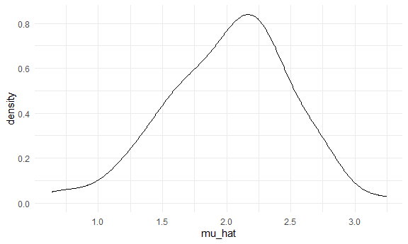

writing_functions
================
2022-10-29

## Simulations

``` r
sim_mean_sd = function(n, mu = 2, sigma = 3) {
  
  sim_data = tibble(
    x = rnorm(n, mean = mu, sd = sigma),
  )
  
  sim_data %>% 
    summarize(
      mu_hat = mean(x),
      sigma_hat = sd(x)
    )
}
```

How did we use this before?

``` r
sim_mean_sd(n = 30)
```

    ## # A tibble: 1 × 2
    ##   mu_hat sigma_hat
    ##    <dbl>     <dbl>
    ## 1   2.89      2.98

How can we use this now?

Let’s start with a for loop

``` r
output = vector("list", length = 100)

for (i in 1:100) {
  output[[i]] = sim_mean_sd(n = 30)
}

bind_rows(output)
```

    ## # A tibble: 100 × 2
    ##    mu_hat sigma_hat
    ##     <dbl>     <dbl>
    ##  1   1.62      3.29
    ##  2   2.56      3.11
    ##  3   1.43      2.43
    ##  4   2.19      2.79
    ##  5   2.28      2.63
    ##  6   2.90      2.79
    ##  7   3.43      3.20
    ##  8   1.98      3.44
    ##  9   1.63      3.44
    ## 10   1.47      3.22
    ## # … with 90 more rows

Let’s use list columns instead

``` r
sim_results_df = 
  expand_grid(
    sample_size = 30,
    iteration = 1:100
  ) %>% #give all possible combinations of this sample size and this iteration
  mutate(
    estimate_df = map(sample_size, sim_mean_sd)
  ) %>%
  unnest(estimate_df)
```

``` r
sim_results_df %>%
  ggplot(aes(x = mu_hat)) +
  geom_density()
```



## what about changing sample size

``` r
sim_results_df = 
  expand_grid(
    sample_size = c(30, 60, 120, 240),
    iteration = 1:100
  ) %>% #give all possible combinations of this sample size and this iteration
  mutate(
    estimate_df = map(sample_size, sim_mean_sd)
  ) %>%
  unnest(estimate_df)
```

``` r
sim_results_df %>%
  mutate(
    sample_size = str_c("N = ", sample_size),
    sample_size = fct_inorder(sample_size)
  ) %>% # violin need x to be factor not number
  ggplot(aes(x = sample_size, y = mu_hat)) +
  geom_violin()
```


``` r
sim_results_df %>%
  mutate(
    sample_size = str_c("N = ", sample_size),
    sample_size = fct_inorder(sample_size)
  ) %>% 
  group_by(sample_size) %>%
  summarize(
    em_st_err = sd(mu_hat)
  )
```

    ## # A tibble: 4 × 2
    ##   sample_size em_st_err
    ##   <fct>           <dbl>
    ## 1 N = 30          0.587
    ## 2 N = 60          0.401
    ## 3 N = 120         0.250
    ## 4 N = 240         0.204

## Let’s see two inputs

``` r
#cache=TRUE saves the result, don't rerun as long as code unchange
#if this code chunk depends on other code chunk, changing the other code chunk doesn not cause this code chunk to rerun, which can cause problems
sim_results_df = 
  expand_grid(
    sample_size = c(30, 60, 120, 240),
    true_sigma = c(6, 3),
    iteration = 1:1000
  ) %>% #give all possible combinations of this sample size and this iteration
  mutate(
    estimate_df = map2(.x = sample_size, .y = true_sigma, ~sim_mean_sd(n = .x, sigma = .y))
  ) %>% #map2 lets sim_mean_sd take two inputs, need to name inputs explicitly
  unnest(estimate_df)
```

``` r
sim_results_df %>%
  mutate(
    sample_size = str_c("N = ", sample_size),
    sample_size = fct_inorder(sample_size)
  ) %>% # violin need x to be factor not number
  ggplot(aes(x = sample_size, y = mu_hat)) +
  geom_violin() + 
  facet_grid(. ~true_sigma)
```


